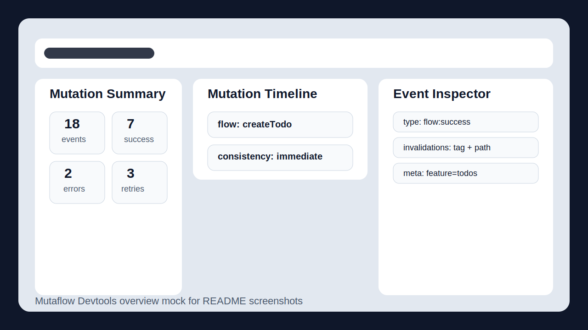
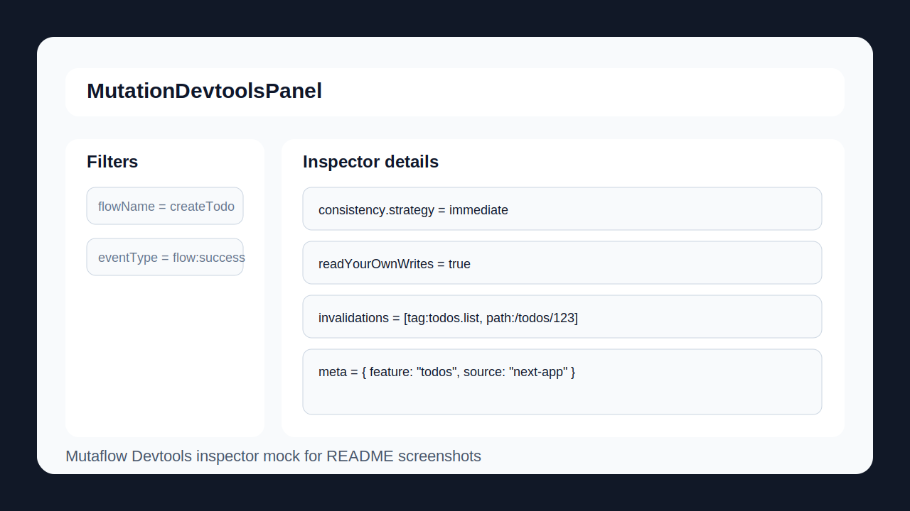

# Mutaflow

[](https://github.com/javaquasar/mutaflow/actions/workflows/ci.yml)
[](LICENSE)

Mutation orchestration for Next.js Server Actions.

Mutaflow is for the part that starts after an action is callable:
- optimistic UI
- rollback and reconcile
- invalidation and consistency
- server action orchestration
- mutation devtools and test helpers

## Why Mutaflow

Server Actions are powerful, but production mutation flows still end up spread across optimistic state, invalidation, retries, redirects, error handling, and custom glue code.

Mutaflow gives that lifecycle one place to live.

## Visuals

### Devtools Overview



### Devtools Inspector



## Packages

- [packages/mutaflow](packages/mutaflow): main runtime package
- [packages/devtools](packages/devtools): grouped timeline, filters, summary, and inspector UI
- [packages/testkit](packages/testkit): test assertions and flow recording helpers

## Quick Start

```ts
import { createFlow, optimistic } from "mutaflow";
import { consistency, createInvalidationRegistry, definePaths, defineTags } from "mutaflow/next";

const registry = createInvalidationRegistry({
  tags: defineTags((tags) => ({
    posts: {
      list: () => tags.posts.list(),
      byId: (id: string) => tags.posts.byId(id),
    },
  })),
  paths: definePaths((paths) => ({
    posts: {
      byId: (id: string) => paths.posts.byId(id),
    },
  })),
});

const createPostFlow = createFlow({
  action: createPost,
  optimistic: optimistic.insert({
    target: "posts:list",
    item: (input) => ({
      id: `temp:${input.title}`,
      title: input.title,
      pending: true,
    }),
  }),
  consistency: ({ result }) =>
    consistency.immediate({
      tags: [registry.tags.posts.list(), registry.tags.posts.byId(result.id)],
      paths: [registry.paths.posts.byId(result.id)],
    }),
});
```

## What You Get

- `createFlow`, `runFlow`, `useFlow`
- optimistic resources with rollback and reconcile
- lifecycle hooks and middleware
- `mutaflow/next`, `mutaflow/next/server`, and `mutaflow/next-safe-action`
- `@mutaflow/devtools`
- `@mutaflow/testkit`

## How It Works

- concept guide: [docs/CONCEPTS.md](docs/CONCEPTS.md)
- includes step-by-step explanations and Mermaid diagrams for flow runtime, optimistic updates, Next cache integration, devtools, and testkit

## Comparison

### Mutaflow vs `next-safe-action`

`next-safe-action` focuses on safe action definition, schemas, and invocation.

Mutaflow focuses on what happens around a mutation after the action exists:
- optimistic behavior
- rollback and reconcile
- invalidation and consistency
- lifecycle hooks and middleware
- grouped devtools
- test assertions for mutation flows

They can work together. Mutaflow is designed to complement `next-safe-action`, not replace it.

### Mutaflow vs Handwritten Server Action Glue

Handwritten glue is flexible, but it usually scatters mutation behavior across:
- server action bodies
- optimistic client state
- retries and cancellations
- cache invalidation calls
- logging and error handling

Mutaflow trades some raw freedom for a more inspectable and reusable mutation system.

## Examples

- [examples/basic/README.md](examples/basic/README.md)
- [examples/next-app/README.md](examples/next-app/README.md)
- [examples/published-next-app/README.md](examples/published-next-app/README.md)

## Release Readiness

- release checklist: [RELEASING.md](RELEASING.md)
- versioning discipline: [VERSIONING.md](VERSIONING.md)
- release history: [CHANGELOG.md](CHANGELOG.md)

## Repository Notes

The repo uses `packages/` intentionally so the runtime and ecosystem packages can evolve together.

See also:
- [POSITIONING.md](POSITIONING.md)
- [MVP_API.md](MVP_API.md)
- [ECOSYSTEM_ROADMAP.md](ECOSYSTEM_ROADMAP.md)
- [CONTRIBUTING.md](CONTRIBUTING.md)
- [CODE_OF_CONDUCT.md](CODE_OF_CONDUCT.md)
