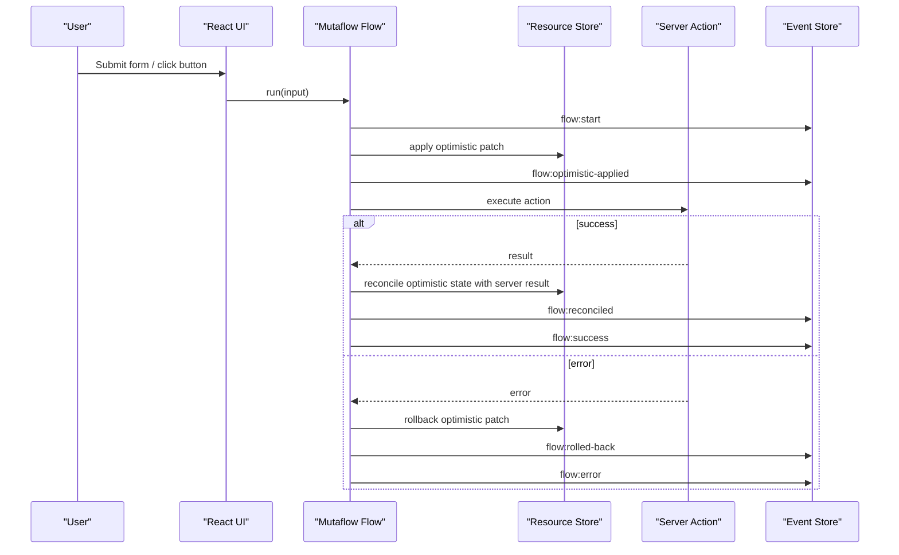
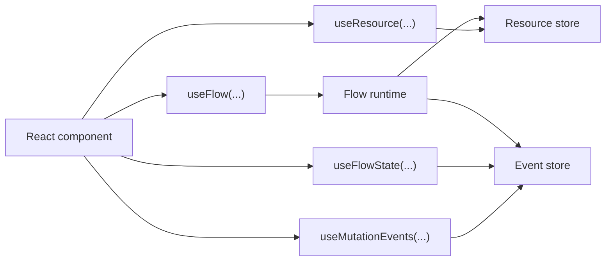
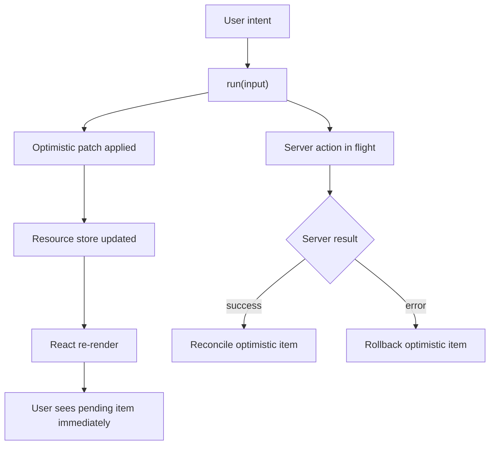
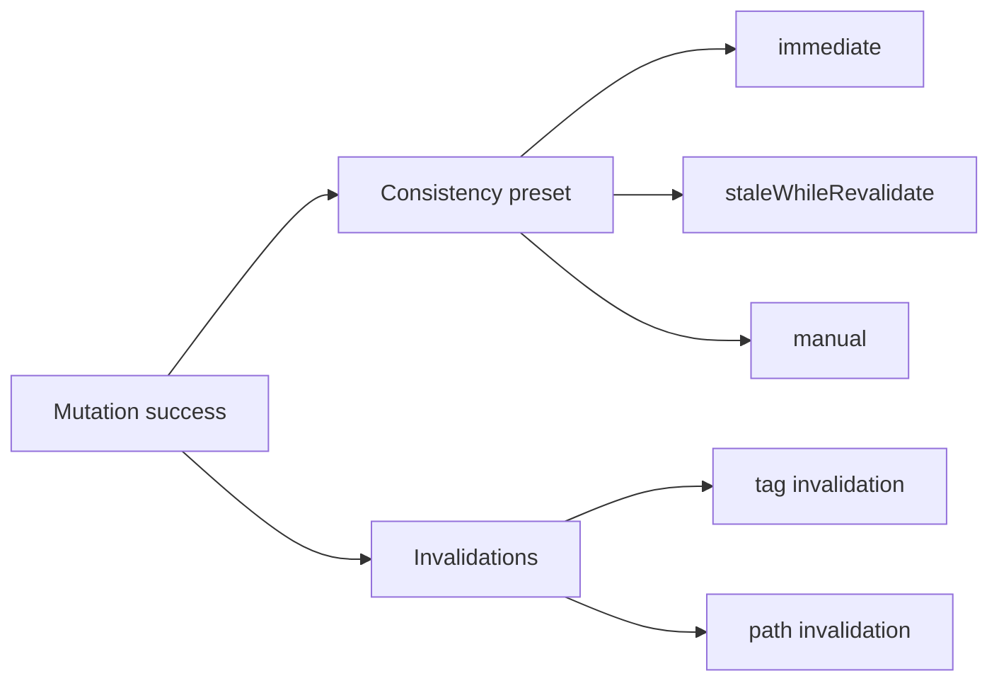
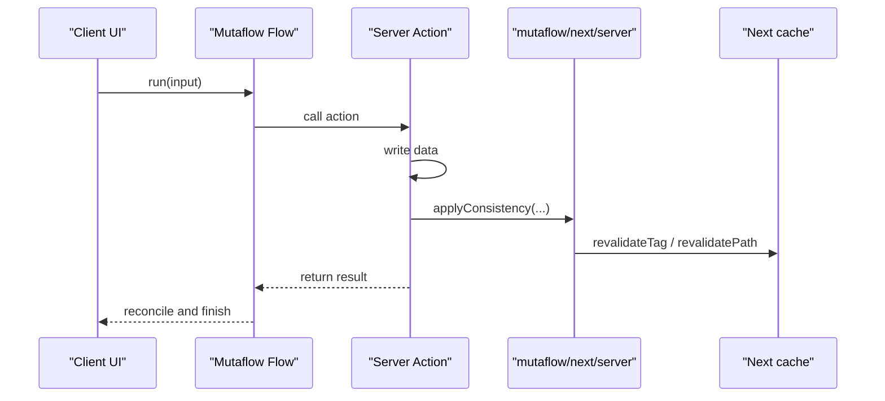
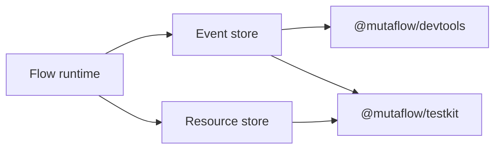

# Mutaflow Concepts

## What Happens In Mutaflow

Mutaflow is not responsible for creating the server action itself. Its job is to describe what happens around a mutation after the action is invoked.

In practice, a flow keeps these concerns in one place:

- server action execution
- optimistic update
- rollback on failure
- reconcile on success
- invalidation and consistency policy
- lifecycle hooks and middleware
- events for devtools and tests

The shortest useful mental model is this:

> A Server Action changes data on the server, and Mutaflow describes the lifecycle of that change in the UI.

## Core Building Blocks

### 1. Action

This is the real server-side operation.

Examples:

- create a todo
- update a post
- delete a comment

An action returns either a result or an error.

### 2. Flow

A flow is a mutation lifecycle definition.

It answers questions such as:

- what should be shown optimistically
- how should failure roll back
- how should the optimistic item be replaced with the real result
- which tags or paths should be invalidated
- which events should be emitted to devtools

### 3. Resource Store

This is the client-side store that Mutaflow uses for optimistic apply, rollback, and reconcile.

Examples:

- `todos:list`
- `posts:list`
- `post:123`

### 4. Event Store

This is the mutation event log.

It exists for:

- devtools
- analytics
- tests
- debugging retries, cancellation, rollback, and consistency behavior

## Lifecycle Overview

The main scenario is simple: the user starts a mutation, the UI updates optimistically right away, and then the state is either confirmed by the server or rolled back.

## How A Flow Connects To The UI

React components do not just read mutation status. They can also read the optimistic resources themselves.

- `useFlow(...)` controls mutation execution
- `useResource(...)` reads the current resource state
- `useFlowState(...)` reads the current stage from the event stream
- `useMutationEvents(...)` exposes raw events for debugging and devtools

## Why Optimistic Updates Feel Fast

The UI does not wait for the server response before showing the change.

The sequence looks like this:

1. the user triggers the mutation
2. the flow immediately applies an optimistic patch
3. the resource store changes
4. `useResource(...)` observes the new state
5. React re-renders immediately
6. the server response arrives later

## Where Consistency And Invalidation Fit

After a successful mutation, an optimistic UI update alone is not enough. You also need to keep server cache and future reads in sync.

That is why Mutaflow models these separately:

- `invalidate`
- `consistency`

`consistency` defines the read-your-own-writes strategy.

Examples:

- `immediate`
- `staleWhileRevalidate`
- `manual`

## What This Looks Like In Next.js

In Next.js, the server action performs the business operation and then uses `mutaflow/next/server` to apply consistency and invalidation through Next cache APIs.

## Where Devtools And Testkit Get Their Data

They are not bolted onto the flow as separate systems. They observe the same event stream and resource state that the flow already produces during execution.

## The Most Useful Mental Model

The cleanest way to think about Mutaflow is:

- the server action changes the data
- the flow defines mutation behavior
- the store drives optimistic UI
- the event store provides observability
- `next/server` helpers connect the mutation to the Next.js cache lifecycle

That is why Mutaflow feels less like a small action helper and more like a mutation orchestration layer.
